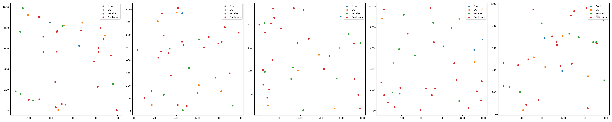
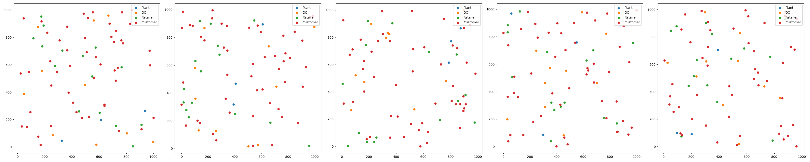
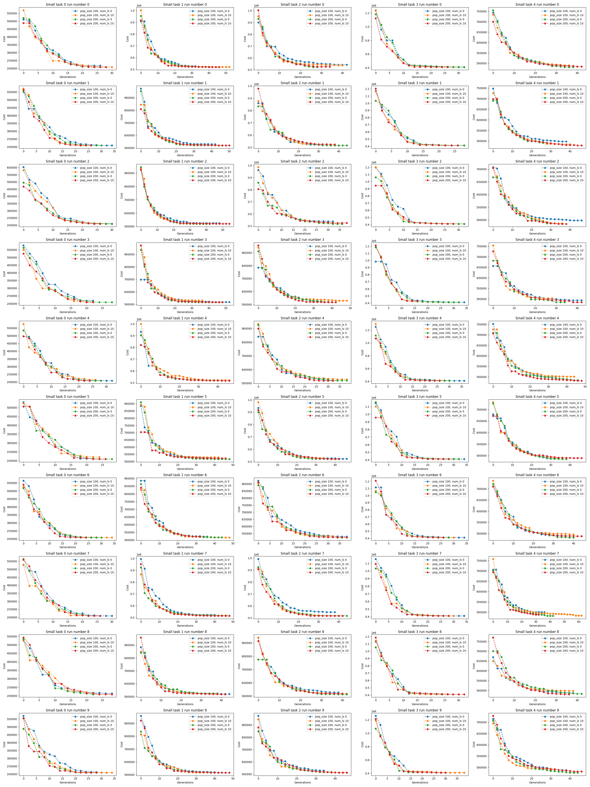
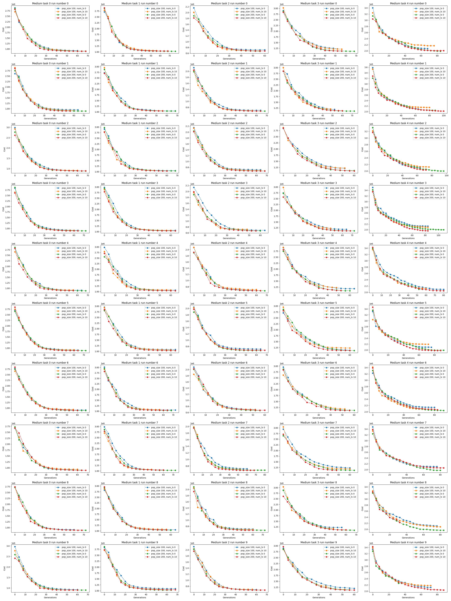
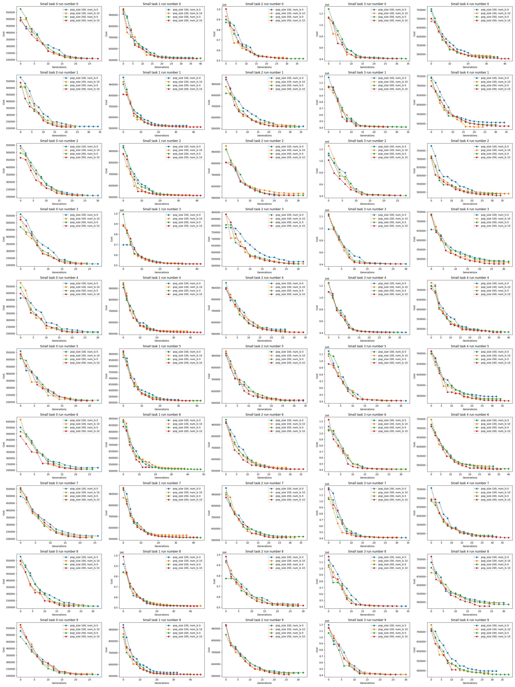
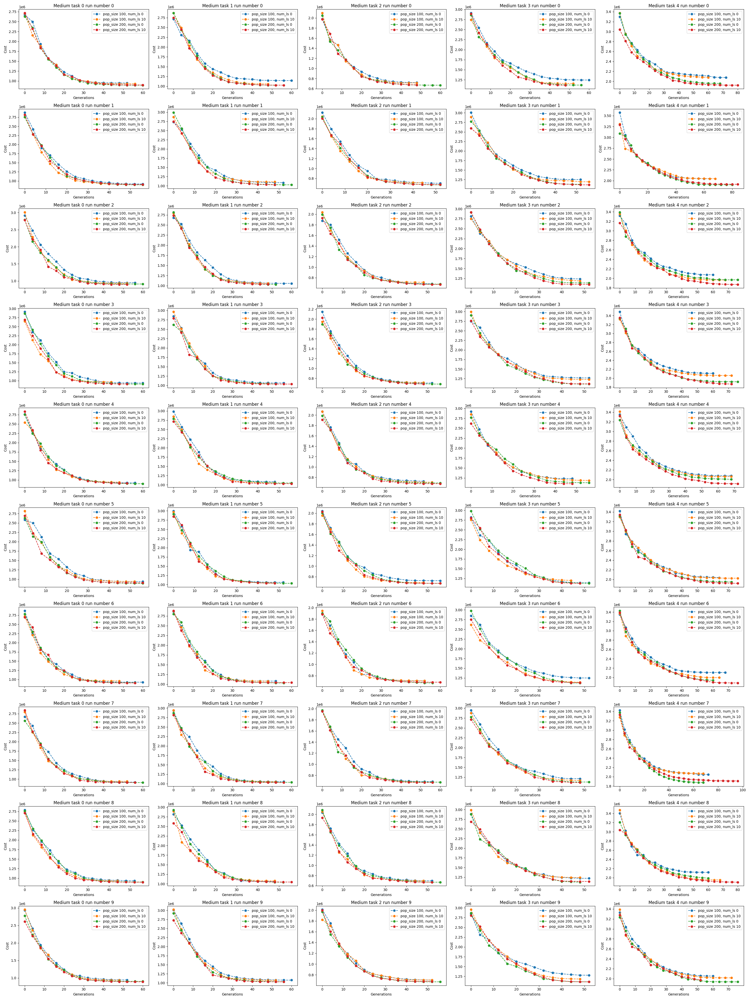

# supply_chain_optimize

## Project Description
In this project, i used evolutionary algorithm to optimize supply chain network, minimize transportation cost while satisfying the supply chain network's constraint.

## The problem
There're 4 parts of a supply chain network: plants, distribution centers (DC), retailers and customers. The task is design a network to deliver products from plants to customers with minimum cost and satisfy all the constraints of plant's output, dc & retailer's storage capacity, customer's demand.

There're 4 types of delivery the network can use:
* Plant -> DC -> Retailer -> Customer
* Plant -> DC -> Customer
* Plant -> Retailer -> Customer
* Plant -> Customer

## The evolutionary algorithm approach
Consider each design of the network mentioned above as an individual in a population, the project uses crossover, mutation and elitism selection mechanism to evolve the population and achieve the individual with the best fitness (the network's design with minimum cost).

In the process of evolution, i also applied a self-fixing mechanism to fix the designs that do not satisfy the supply chain network's constraints.

## Experiment Results
To benchmark the algorithm, a number of tasks with 3 sizes (small, medium, large) is generated.

### Problem settings
#### Small Tasks

#### Medium Tasks

#### Large Tasks

#### Results
Each task is optimized with 10 independent runs with 4 different parameter settings (population size, number of local search each generation) and 2 crossover operations.

Two-cut crossover
* Small tasks

* Medium tasks

* Large tasks

Combinatorial crossover
* Small tasks

* Medium tasks

* Large tasks
